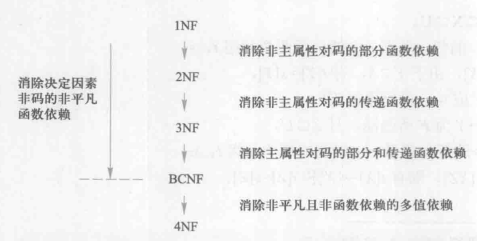

# 数据库考试笔记汇总

**作者：Hongtauo**
**Link：https://github.com/Hongtauo/Introduction_to_databases**
# 第一章
## 数据库概述
### 基本概念
四个基本概念：数据、数据库、数据库管理系统、数据库系统
#### 数据Data
数据(Data)是数据库中存储的基本对象
#### 数据库Database
+ 定义
数据库(Database,简称DB)是长期储存在计算机内、有组织、可共享的大量数据的集合
+ 特征
概括性：永久存储、有组织、可共享
    + 按照一定的数据模型组织、描述和存放
    + 具有较小的冗余度
    + 具有较高的独立性
    + 具有易扩展性
    + 可以为各种用户共享
#### 数据库管理系统Database Management System （DBMS）
+ 定义
DBMS是位于用户与操作系统之间的一层数据管理软件。是基础软件，是一个大型复杂的软件系统
+ 功能
    + 数据定义
    + 数据组织、存储和管理
    + 数据操纵
        + 数据库的基本操作：增、删、查、改
    + 数据库事务管理和运行管理
        + 确保数据的安全性，完整性，多用户的并发使用以及发生故障后的恢复
    + 数据库建立和维护功能
    + 其他功能
#### 数据库系统Database System
数据库系统是由数据库、数据库管理系统（及其应用开发工具）、应用程序和数据库管理员组成的存储、管理、处理和维护数据的系统。
### 数据管理技术的产生与发展
#### 数据管理和数据处理
+ 数据管理的定义
数据库技术是指对数据进行分类、组织、编码、存储、检索、维护，是数据处理的中心问题。
+ 数据处理的定义
数据处理是指对各种数据进行收集、存储、加工和传播的一系列活动的总和
#### 数据管理技术的发展


#### 总结
从文件系统到数据库系统标志着数据管理技术的飞跃
### 数据库系统的特点
与人工管理与文件系统相比、数据库系统的特点主要有
+ ==数据结构化==
数据库的主要特征之一，数据库中最小的单位是数据项
+ 数据共享性高、冗余度低、易于扩充
+ 数据独立性高
数据独立性是由数据库管理系统提供的==二级映像==功能来保证的
    + 数据独立性
    + 物理独立性
    + 逻辑独立性
+ 数据由数据库管理系统统一管理和控制
    + 安全性保护
    + 完整性检查
    + 并发控制
    + 数据库恢复 

## 数据模型
数据模型是一种模型，是对现实世界的数据特征的抽象，是用来描述数据、组织数据、对数据进行操作的，==数据模型是数据库系统的核心与基础==
####  ==数据模型要满足的三个要求==
+ 比较真实的模拟现实世界
+ 容易被人所理解
+ 便于在计算机上实现
#### 组成要素
+ 数据结构
+ 数据操作
+ 数据的完整性约束条件
### 两类数据模型
#### 概念模型（信息模型）
它是按用户的观点来对数据和信息建模，用于数据库设计
+ 信息世界中的基本概念
    + 实体
    + 属性
    + 码
    + 实体型
    + 实体集
    + 联系
+ 概念模型的一种表示方法
E-R图
#### 逻辑模型和物理模型
+ 逻辑模型主要包括==网状模型、层次模型、关系模型、面向对象模型==等，按计算机系统的观点对数据建模，用于DBMS实现。
+ 物理模型是对数据最底层的抽象，描述数据在系统内部的表示方式和存取方法，在磁盘或磁带上的存储方式和存取方法。
#### 两步抽象
首先将现实世界抽象为信息世界，然后将信息世界转换为机器世界


### 关系模型
关系模型是一种最重要的数据模型
+ 数据结构
    + 关系
    + 元组
    + 属性
    + 码
    + 域
    + 分量
    + 关系模式
+ 数据操作以及完整性约束
    + 操作（关系模式中数据的操作都是==集合操作==，==操作对象和操作结果都是关系==）
        + 增删查改
    + 三大完整性（四大完整性还有一个叫做域完整性）
        + 实体完整性
        + 参照完整性
        + 用户定义完整性
+ 关系模式的优缺点
    + 优点
        + 严格建立在数学概念的基础上
        + 关系模型的概念单一、清晰易懂
        + 关系模式的存储路径对用户透明、拥有更高的数据独立性、安全保密性，简化了程序员的工作和数据库开发建立的工作
    + 缺点
        + 存储路径对用户是隐蔽的
## 数据库系统的结构（模式结构）
### 概念
模式是数据库中全体数据的逻辑结构和特征的描述，设计型的描述，不涉及具体的值，模式的值称为模式的实例，一个模式下存在很多实例，模式是相对稳定的，而实例是变动的，因为数据库中的数据在不断地更新中。
+ 模式反映的是数据结构及其联系
+ 实例反映的是数据库某一时刻的具体状态
### 三级模式

#### 外模式（子模式、用户模式）
+ 概念
数据库用户（包括应用程序员和最终用户）使用的局部数据的逻辑结构和特征的描述，是数据库用户的数据视图，是与某一应用有关的数据的逻辑表示，可以看成把数据库的部分数据，运用在不同的应用程序上，在UI界面上显示
+ 关系
    + 外模式是模式的子集，一个数据库可以有多个外模式
    + 外模式是保证数据库安全性的一个有力措施，每个用户只能看见和访问对应的外模式的数据，数据库中其他的数据不可见
    + 模式与外模式是1对多的关系
    + 外模式与应用是一对多的关系
#### 模式（逻辑模式）
+ 概念
    + 数据库中全体数据的逻辑结构和特征的描述
    + 所有用户的公共数据视图，综合了所有用户的需求
    + 是数据库系统模式结构的中间层，不涉及数据的物理存储细节和硬件环境，与与具体的应用程序、开发工具及高级程序设计语言无关
    + ==一个数据库只有一个模式，可以把模式看成唯一的数据库，实例就是数据库里面的多个表==
+ 定义
    + 数据的逻辑结构（数据项的名字、类型、取值范围等
    + 数据之间的联系
    + 数据有关的安全性、完整性要求
#### 内模式（存储模式）
+ 是数据物理结构和存储方式的描述
+ 是数据在数据库内部的表示方式:
    + 记录的存储方式（顺序存储，按照B树结构存储，按hash方法存储）
    + 索引的组织方式
    + 数据是否压缩存储
    + 数据是否加密
    + 数据存储记录结构的规定
+ 一个数据库只有一个内模式
### 二级映像
#### 概念
三级模式是对数据的三个抽象级别，二级映象在DBMS内部实现这三个抽象层次的联系和转换
==二级映像保证了数据库系统中的数据具有较高的逻辑独立性与物理独立性==
#### 外模式／模式映像（保证逻辑独立性）
#### 模式／内模式映像（保证物理独立性）
模式／内模式映象定义了数据全局逻辑结构与存储结构之间的对应关系

# 第二章
## 关系数据结构及其形式化定义
### 关系
#### 关系
关系是关系模型中的非常简单的数据结构，现实世界中的实体与实体之间的各种联系均用关系来表示，能够描绘现实世界的实体与实体间的各种联系
#### 关系模型
关系模型是建立在集合代数为基础上的，关系模型的数据结构很单一——关系，从用户的角度上看，关系数据库的数据的逻辑结构就是一张二维表
### 集合论角度的关系数据结构定义
#### 关系
+ 域
    + 域是一组==具有相同数据库类型的值的集合==
+ 笛卡尔积
    + ==所有域的取值==的组合
    + 给定一组域D1，D2，…，Dn，这些域中可以有相同的。D1，D2，…，Dn的笛卡尔积为：
    
    笛卡尔积中不存在重复的元组
        + 元组
        笛卡尔积中的每一个元素（d1，d2，…，dn）叫做一个n元组或者元组
        + 分量
        笛卡尔积元素（d1，d2，…，dn）中的每一个值di叫作一个分量;
        + 基数
        一个域允许的不同取值个数叫做这个域的基数，笛卡尔积后的基数相当于是笛卡尔积元组的个数，等于每个域的基数的乘积，
+ 关系
关系是笛卡尔积的有限子集，笛卡尔积是没有实际意义的，==笛卡尔积的某个真子集才有实际意义==，关系是一张二维表
    + D1×D2×…×Dn的子集叫作在域D1，D2，…，Dn上的关系，表示为：R（D1,D2,D3......Dn），R叫做关系名，n叫做关系的目或度
    + 关系的每一个元素叫做元组
    + 关系是一张二维表，表的行代表一个元组，表的列代表一个域，由于域是可以相同的，为了区分，每一列都需要取一个名字，这个叫做属性
    + n个属性就必有n个属性，==但是属性并不一定来自不同的域==
+ ==码==    
    + 候选码
    关系模式中，某一属性组（属性/属性组）的值能够唯一地标识一个元组，而它的子集不能，则称该属性组为候选码
    + 主码
    关系模式中，存在多个候选码，则选定其中一个作为主码（人为确定）
    + 全码
    关系模式中的所有属性都是候选码
    + 主属性
    候选码的所有属性（诸属性）称为主属性
    + 非主属性
    不包含在任何候选码中的属性称为非主属性
+ 关系的三种类型
    + 基本关系（基本表或基表）
    实际存在的表，是实际存储数据的逻辑表示
    + 查询表
    查询对应结果的表
    + 视图表
    虚表，由基本表或其他视图表导出的表，不对应实际存储的数据
+ 基本关系的性质
    + ① 列是同质的（Homogeneous）;
    + ② 不同的列可出自同一个域,其中的每一列称为一个属性,不同的属性要给予不同的属性名;
    + ③ 列的顺序无所谓，列的次序可以任意交换;
    + ④ 任意两个元组的候选码不能相同;
    + ⑤ 行的顺序无所谓，行的次序可以任意交换;
    + ⑥ 分量必须取原子值,这是规范条件中最基本的一条;
#### 关系模式
关系数据库中，关系模式是型，关系是值，关系模式是对关系的描述
+ ==关系模式必须指出这个元组集合的结构==
    + 由哪些属性构成
    + 属性来自哪些域
    + 属性与域之间的映像关系
+ 元组语义以及完整性约束条件
+ 属性的数据依赖关系（第六章）
#### 关系模式的定义
+ R（U，D，DOM，F）
+ R 关系名
+ U 组成该关系的属性名集合
+ D 属性组U中属性所来自的域
+ DOM 属性向域的映象集合
+ F 属性间的数据依赖关系集合

#### 关系与关系模式的对比（类和对象）
+ 关系模式
对关系的描述静态的、稳定的
+ 关系
关系模式在某一时刻的状态或内容，动态的、随时间不断变化的，关系模式和关系往往统称为关系
#### 关系数据库
在一个给定的领域中，所有关系的集合构成一个关系数据库
关系数据库也有型和值之分，关系数据库的型叫做==关系数据库模式==，是对关系数据库的==描述==
+ 关系数据库的型：关系数据库的型也叫关系数据库的模式，对关系数据库的描述，包括若干域的定义、以及在这些域上定义的若干关系模式
+ 关系数据库的值：这些关系模式在某一时刻对应的关系的集合，简称为关系数据库
#### 关系模型的存储结构
+ 表是关系数据的逻辑模型
+ 表的存储是关系模型的存储结构
## 关系操作
关系操作的对象是集合，关系操作的结构也是集合，这种方式叫做一次一集合
### 基本的关系操作
#### 更新
+ 增
+ 删
+ 改
#### 查询（高亮的为基本的操作，其余操作可以使用基本的操作导出）
+ ==选择==
+ ==投影==
+ 连接
+ 除
+ ==并==
+ ==差==
+ 交
+ ==笛卡尔积==
### 关系数据库的语言
## 关系完整性
实体完整性和参照完整性是关系模型必须满足的完整性约束条件，称为关系的两个不变性，应该由关系系统自动支持
### 实体完整性
若属性A是基本关系R的主属性，则属性A不能取空值
1) 实体完整性规则是针对基本关系而言的。一个基本表通常对应现 实世界的一个实体集。
2) 现实世界中的实体是可区分的，即它们具有某种唯一性标识。
3) 关系模型中以主码作为唯一性标识。
4) 主码中的属性即主属性不能取空值。主属性取空值，就说明存在某个不可标识的实体，即存在不可区分的实体，这与第（2）点相矛盾，因此这个规则称为实体完整性
### 参照完整性
#### 外码


1) 设F是基本关系R的一个或一组属性，==但不是关系R的码==。如果F与基本关系S的主码Ks相对应，则称F是基本关系R的外码,即该码是另一个表的主码。
2) 基本关系R称为参照关系（Referencing Relation），即本表。
3) 基本关系S称为被参照关系（Referenced Relation） 或目标关系（Target Relation），即外码对应的主码所在的表。
4) ==被参照关系的主码和参照关系的外码必须定义在同一个域上==
5) ==被参照关系和参照关系不一定是不同的关系==（自身参照）
#### 定义
若属性（或属性组）F是基本关系R的外码它与基本关系S的主码Ks相对应（基本关系R和S不一定是不同的关系），则对于R中每个元组在F上的值必须为：
1) 或者取空值（F的每个属性值均为空值）
2) 或者等于S中某个元组的主码值

==外码的值要么为空，要么为S中某个元组的主码值==
### 用户定义完整性
满足语义要求，针对某一具体关系数据库的约束条件，反映某一具体应用所涉及的数据必须满足的语义要求

## 关系代数
关系代数是一门抽象的==查询==语言，对关系镜像查询表达
==运算的三大要素是：运算对象、运算符、运算结果==
==关系代数的运算对象是关系，运算结果也为关系==
### 集合运算符
####  并 Union
$$R∪S=﹛t|t∈R∨t∈S﹜$$
####  交 Intersection
$$R∩S=﹛t|t∈R∧t∈S﹜$$
####  差 Expect
$$R-S=﹛t|t∈R∧t∉S﹜$$
####  笛卡尔积 Cartesian product
$$R×S=﹛trts|tr∈R∨ts∈S﹜$$
### 关系运算符（在关系运算符中，运算经过有限次复合后形成的表达式称为关系代数表达式）
#### 选择 Selection（从行的角度进行考虑）
选择又叫做限制，在关系R中选择满足给定条件F为真的诸元组
$$σF(R)=﹛t|t∈R∧F(t)='True'﹜$$
选择操作中的R表示关系，$F$叫做选择条件，选择条件是一个逻辑表达式，逻辑值有“真”，“假”两种，逻辑表达式的基本形式为
$$X1θY1$$
其中的$θ$为比较运算符，也可也进行逻辑运算


+ 例子
σSdept=‘IS’(Student)表示在学生表中选择属性Sdept=‘IS’的学生
σAge<20(Student)表示在学生表中选择属性年龄小于20岁的学生

#### 投影 Projrction（从列的角度进行考虑，投影后会消除重复的元组）
$$∏A(R)=﹛t|t[A]|t∈R﹜$$
其中A为R中的属性列
+ 例子
∏Sname(Student)表示查询学生姓名列
∏Sname，Sdept(Student)表示查询学生姓名以及所在系列

#### 连接 Join
+ 等值连接 
等值连接是在关系R与S的广义笛卡尔积中选择属性A与B相等的元组


+ 自然连接
自然连接是特殊的等值连接，对于R和S两个关系的笛卡尔积中，考虑的是R和S中相同名的属性组进行组合操作，并去除重复的列


+ 悬浮元组
悬浮元组是那些在自然连接操作中被舍弃的元组
    + 外连接
    把悬浮元组保存在结果关系中，而其他属性上填空值NULL，这种连接叫外连接
    + 左外连接
    保留左边关系的悬浮元组
    + 右外连接
    保留右边关系的悬浮元组
#### 除 Division
除运算表示的是在关系R与S上具有同名的属性列中，取属性R在同名属性或属性组上的像集==包含了==属性S在该同名属性或属性组上的投影


+ 例题


# 第三章
## 数据查询
### Select 语句的一般格式
SELECT [ALL|DISTINCT]   
<目标列表达式> [别名] [ ，<目标列表达式> [别名]] … 
FROM   <表名或视图名> [别名]   [ ，<表名或视图名> [别名]] …
[WHERE <条件表达式>]
[GROUP  BY<列名1>
[HAVING  <条件表达式>]]
[ORDER BY <列名2> [ASC|DESC] 
## 数据更新
### 插入
INSERT
INTO <表名> [(<属性列1>[，<属性列2 >…)]
VALUES (<常量1> [，<常量2>]    …           )
### 更新
UPDATE  <表名>
SET  <列名>=<表达式>[，<列名>=<表达式>]…
[WHERE <条件>];
### 删除
DELETE
FROM Student
WHERE Sno= '200215128';
## 视图
### 视图语句格式
CREATE  VIEW <视图名>  [(<列名>  [，<列名>]…)]
AS  <子查询>
[WITH  CHECK  OPTION]；
#### 查询视图
#### 更新视图
# 第四章
## 基本概念
### 审计

# 第五章
+ 数据库的完整性是指数据的正确性、相容性，正确性是指数据是符合现实世界语义的、反映当前实际状况的，数据的相容性是指数据库同一对象在不同的关系表中的数据是符合逻辑的
+ 数据库管理系统必须能够提供违约处理
    + 提供定义完整性约束条件的机制
    + 提供完整性检查的方法
    + 进行违约处理
+ 关系数据库是的完整性控制称为其核心支持的功能，能够为所有用户和应用提供一致的数据库完整性
## 实体完整性
实体完整性即对主码的完整性约束，主码必须唯一，主码不得为空
### 完整性定义
#### 列级约束条件
```SQL
CREATE TABLE Student
{
    Sno CHAR(9) PRIMARY KEY,
    Sname CHAR(20) NOT NULL,
    Sex CHAR(2),
    Sage SMALLINT,
    Sdept CHAR(20)
};
```
#### 表级约束条件
```SQL
CREATE TABLE Student
{
    Sno CHAR(9),
    Sname CHAR(20) NOT NULL,
    Sex CHAR(2),
    Sage SMALLINT,
    Sdept CHAR(20)
    PRIMARY KEY(Sno)
};
```
### 完整性检查和违约处理
#### 完整性检查（自动在主码上创建B+树）
1) 检查主码是否唯一
2) 检查主码的各个属性是否为空
#### 违约处理
拒绝==插入==或==修改== 
## 参照完整性
参照完整性是对于有参照关系的两张表，参照表的外码（外码不是主属性的情况下且没有NOT NULL限制）要么为空，要么为被参照表的主码
+ 外码是主属性
在学生表Student-选课表SC中，选课SC的表的候选码为（学号Sno、课程号Cno），选课表SC参照了学生表Student，所以选课表SC中的学号Sno为外码，此时外码作为主属性不能为空
+ 外码不是主属性
外码不是主属性的情况下且==没有NOT NULL的限制==下，外码可以为空，表示当前关系未知、还未确定
### 四种可能破坏参照完整性的情况
| 被参照表 | 参照表（外码所在表） | 违约处理 |
| :--: | :--: | :--: |
| 可能破坏参照完整性 | 插入 | 拒绝 |
| 可能破坏参照完整性 | 修改外码值 | 拒绝 |
| 删除 | 可能破坏参照完整性 | 拒绝/级联删除/外码设置为空值 |
| 修改主码值 | 可能破坏参照完整性 | 拒绝/级联删除/外码设置为空值 |
### 完整性检查与违约处理
| 操作 | 解释 |
| :--: | :--: |
| 拒绝 | 不允许进行操作（默认策略） |
| 级联 | 顾名思义就是两个表都进行更新操作，被参照表修改或删除一个元组导致无法与参照表对应后，参照表也修改或删除该元组 |
| 设为空值 | 被参照表进行修改或者删除元组后，参照表的外码无法在被参照表中找到一个值与之对应，这个时候将参照表的不一致的元组的对应属性设置为空值 |
## 用户定义完整性
对于某一具体的应用数据必须满足语义的要求
### 属性上的约束条件
#### 列值非空
NOT NULL

#### 列值唯一
UNIQUE
#### 满足条件表达式
CHECK(条件)

### 元组上的约束条件
使用CHECK进行检查，在元组上的限制可以设置不同属性之间取值的相互约束条件
### 完整性检查和违约处理
不满足则拒绝执行
## 完整性约束命名子句

# 第六章
关系模式的定义
R(U,D,DOM,F)
R为关系名
U为关系属性的集合
D为U中属性所来自的域
DOM为属性向域的映像集合
F为属性组U上的数据依赖
在本章将关系模式转换为三元组即R(U,F)，研究属性之间的数据依赖关系，
## 数据依赖
数据依赖是一个关系内部与属性之间的一种约束关系，分为函数依赖和多值依赖，这种约束关系是现实世界中属性间相互联系的抽象，是内在的属性，也是语义的体现，在关系模式R中所有的关系实例均要遵从约束条件
+ 函数依赖
当一个属性确定后，关系也就确定了，类似于函数y=f(x),x唯一确定y，
+ 多值依赖
## 规范化
一个好的关系模式应当不会发生插入异常、删除异常、和更新异常，数据冗余尽可能地少，关系模式的规范化过程是通过对关系模式的分解来实现的，把低一级的关系模式分解为若干个高一级的关系模式
###  函数依赖
#### 定义
在关系模式R(U)中，X与Y是属性集U的子集，对于R(U)的任何一个关系r，都不存在当r1[X]=r2[X]时，r1[Y]!=r2[Y]，即X唯一确定Y，也叫X函数确定Y或Y函数依赖于X，记作X->Y
#### 平凡的函数依赖
在关系模式中，一组属性函数决定他的子集，叫做平凡函数依赖，不产生新的语义
#### 非平凡的函数依赖
在关系模式中，存在函数依赖X->Y,但是Y不是X的子集
#### 完全函数依赖
在关系模式中，若X函数决定Y，X的真子集不能函数决定Y，叫做X完全函数决定Y，也叫做Y完全函数依赖于X
#### 部分函数依赖
在关系模式中，若X函数决定Y，存在X的真子集能够函数决定Y，叫做X部分函数决定Y，也叫做Y部分函数依赖与X（Y对X部分函数依赖）
#### 传递函数依赖
设X,Y,Z是关系R中互不相同的属性集合，存在==X→Y(Y !→X),Y→Z==，则称Z传递函数依赖于X。
### 码（用函数依赖的概念进行界定）
#### 候选码
在关系模式R中，某个属性或者属性组合能够完全函数决定整个属性集，则称该属性或者属性组为候选码，即整个属性集U完全函数依赖于这个属性或属性组
#### 超码
在关系模式中，该属性组部分函数决定整个属性集U，而存在该属性组的真子集能够完全函数决定整个属性集U的，则称该属性组部分函数决定属性集U，即属性集U部分函数依赖于该属性组
#### 主属性
候选码中的任意一个属性叫做主属性
#### 非主属性
不在候选码中的属性叫做非主属性
###  范式
一个低一级的范式可以通过模式分解转换为若干个高一级范式的关系模式的集合
#### 1NF
满足最低要求的叫做第一范式，作为一个二维表，关系要符合一个最基本的条件：每一个分量必须是不可分的数据项。满足了这个条件的关系模式就属于第一范式（1NF）。
#### 2NF
在满足1NF（第一范式）的前提下，消除了非主属性对于码的部分函数依赖，则称为关系模式R满足第二范式，记作R∈2NF
#### 3NF
在满足2NF（第二范式）的前提下，消除了非主属性对于码的传递函数依赖，则称为关系模式R满足第三范式，记作R∈3NF
#### BCNF
在满足1NF（第一范式）的前提下，消除了==任何属性==对于码的部分函数依赖和传递函数依赖（也可也看作是在3NF的前提下，消除了主属性对于码的部分函数依赖和传递函数依赖），则称为关系模式R满足BC范式，记作R∈BCNF
#### 4NF
在满足1NF（第一范式）的前提下，消除了任何属性之间的非平凡且非函数依赖的多值依赖（如果一个关系属于4NF，那么必定满足BCNF）



## 数据依赖的公理系统
数据依赖的公理系统是模式分级算法的理论基础
### 求给定关系的码
==码的定义就是其闭包包含所有的属性==
L型，R型，LR型根据属性出现的左右来区分:
+ L型是属性只在左部出现。
+ R型是属性只在右部出现。
+ LR型是属性在两侧都出现。
1) L型肯定在码内，然后求L型的闭包，如果包含U，那么就是码
2) R型一定不是码，LR型可能是码，逐个求闭包，如果闭包包含U，那么就是码

# 第七章 
数据库设计的六大步骤
1) 需求分析
2) 概念结构设计
3) 逻辑结构设计
4) 物理结构设计
5) 数据库实施
6) 数据库维护
## 步骤一：需求分析
## 步骤二：概念结构设计（E-R模型）
P.P.S.Chen提出的E-R模型来描述现实世界的概念模型
### 实体之间的联系
一般把参与联系的实体型的数目叫做联系的度
#### 两个实体型之间的联系
1) 一对一联系（1:1）
2) 一对多联系（1:n）
3) 多对多联系（n:m）


#### 多个实体型之间的联系
1) 一对一联系（1:1）
2) 一对多联系（1:n）
3) 多对多联系（n:m）


#### 单个实体型之间的联系
1) 一对一联系（1:1）
2) 一对多联系（1:n）
3) 多对多联系（n:m）


### E-R图
E-R图提供了表示实体型、属性和联系的方法
1) 实体型用矩形表示，矩形框内写明实体名
2) 属性用椭圆表示，用无向边把属性和实体联系起来
3) 联系用棱形表示，棱形框内写明联系名，用无向边与联系连接起来，在无向边上标注联系的类型
4) 如果联系有属性，那么属性也要标注出来
### 概念结构设计
#### 实体与属性划分的原则
为了简化E-R图，现实世界的事物能作为属性的尽量作为属性
1) 属性不能够有需要描述的性质，属性是不可分的数据项，不能包含其他属性
2) 属性不能与其他实体具有联系
#### E-R图的集成
+ 合并
需要消除三大冲突：属性冲突、命名冲突、结构冲突
+ 修改和重构
删除不必要的冗余
## 步骤三：逻辑结构设计：E-R模型向关系模型的转换
主要解决的问题是，如何将实体型和实体间的联系转换为关系模式，并且确定关系模式的属性和码
### 转换的一般原则
#### 一个1:1的联系可以转化为一个独立的关系模式，也可与任意一端的对应的关系模式合并


可以转换为：
工厂（厂号，厂名，地点，姓名，任期）
厂长（姓名，性别，年龄）
或者：
工厂（厂号，厂名，地点）
厂长（姓名，性别，年龄，厂号，任期）
#### 一个1:n的关系可以转化为一个独立的关系模式，也可与n端对应的关系模式合并


可以转换为：
仓库（仓库号，地点，面积）
商品（货号，品名，价格，仓库号，数量）


可以转换为：
职工（工号，姓名，年龄，性别，职称，工资，领导者工号，民意测验）
#### 一个m:n的关系可以转换为一个关系模式，与该联系相连的各实体的码以及本身连接的属性均转换为关系的属性，各实体的码组成关系的码或者关系的码的一部分
必须为这个“联系”单独建立一个关系，该关系中至少应包含被它所联系的双方实体的“主码”，如果联系有属性，也要纳入这个关系中。由于这个“联系”只涉及一个实体，所以加入的实体的主码不能同名。


可以转换为：
学生（学号，姓名，性别，年龄）
课程（课程号，课程名，学时）
选修（学号，课程号，成绩）


可以转换为：
零部件（代号，名称，价格）
组装（代号，组装件代号，数量）
#### 具有相同码的关系模式可以合并
## 步骤四：物理结构设计
数据库的物理设计是指对一个给定的逻辑数据库模型选取一个最适合应用环境的物理结构的过程。物理设计通常分为两步
1) 确定数据库的物理结构
+ 确定数据存取的方法
    + 索引方法的选择
    + 聚簇方法的选择
+ 确定数据的存储结构
    + 确定数据的存放位置
        + 基本原则:根据应用情况将易变部分与稳定部分分开存放、存取频率较高部分与存取频率较低部分分开存放
    + 确定系统配置
2)  物理结构进行评价
## 步骤五：数据库实施
实施阶段的工作主要有：
1) 建立数据库结构
2) 数据载入
数据库结构建立好后，就可以向数据库中装载数据了。组织数据入库是数据库实施阶段最主要的工作。
3) 应用程序的编码和调试
4)数据库试运行
## 步骤六：数据库的运行与维护
数据库系统投入正式运行后，对数据库经常性的维护工作主要由 DBA 完成，包括：
1) 数据库的转储和恢复
2) 数据库的安全性、完整性控制
3) 数据库性能的监督、分析和改造
4) 数据库的重组与重构

# 第十章
## 事务的基本概念
事务是恢复和并发控制的基本单位
### 事务
事务是用户定义的一个数据库操作序列，要么全做，要么不做，是一个不可分割的基本单位
+ 事务可以是一条SQL语句，一组SQL语句，或者是整个程序
+ 事务和程序是两个概念，一般情况下一个程序包含多个事务
+ 事务的开始与结束可以由用户显式控制，如果没有显式控制，数据库管理系统按照默认的规定自动划分事务
+ 语句
    + 开始标志
    BEGIN TRANSACTION;
    + 正常结束标志
    COMMIT;
    + 出现异常，回滚标志
    ROLLBACK;
    运行过程中发生某些故障，所有已完成的操作（更新操作）全部撤销，回滚到事务刚开始的标志
### 事务的ACID特性
#### 原子性
要么全做，要么不做
#### 一致性
数据库只包含成功事务提交的结果的时候，叫做数据库处于一种一致性状态
#### 隔离性
一个事务的执行不能被其他事务干扰，并发执行的事务之间不能互相干扰
#### 持续性
持续性也叫永久性，一个事务一旦提交，他对数据库的数据改变就应该是永久的，接下来的其他操作或故障不应对其操作执行的结果有影响
### 事务ACID可能遭到破坏的原因
1) 多个事务并行运行适，不同事务交叉执行
2) 事务运行过程中被强制停止
## 数据库恢复概述
原理：冗余
###  故障的种类
总的来讲有两类故障：第一类是数据库本身的故障，第二类是数据库没有被破坏，但数据可能不正确
#### 事务内部的故障
事务内部的故障有的是可通过事务程序本身发现的，有的是非预期的，不能由事务程序处理
#### 系统故障（软故障）
造成系统停止运转的任何事件，使得系统要重新启动
#### 介质故障（硬故障）
外存故障，如磁盘损坏，磁头碰撞，瞬间强磁场干扰，这类故障破坏数据库或者部分数据库，影响着正在存取这部分数据的所有事务
#### 计算机病毒
人为制造的故障或破坏
##  恢复的技术
建立冗余数据最常用的技术是数据转储和登记日志文件
### 数据转储
数据库管理员定期将整个数据库复制到磁带、磁盘或者其他存储介质上保存起来的过程，这些备用的数据叫做后备副本或者后援副本。
重装副本只能将数据库恢复到转储之前的状态，还需要重新运行自转储之后的所有更新事务


#### 静态转储
在数据库无运行事务的时候进行的转储操作，转储操作开始的时刻数据库处于一致性状态，转储期间不允许对数据库的任何存取，修改活动，静态转储得到的一定是一个数据一致性的副本
#### 动态转储
动态存储允许在转储期间对数据库进行存取或修改，但是转储之后的后备副本上的数据不能够确保正确有效，所以必须建立日志文件，能够把数据库恢复到一个一致性的状态
#### 海量存储
每次转储全部数据库
#### 增量存储
每次只转储上一次转储之后更新的数据


### 登记日志文件
日志文件是用来记录事务对数据库进行更新操作的文件
#### 格式和内容
+ 格式
两种格式，==以记录为单位的日志文件，以数据块为单位的日志文件==
+ 以记录为单位的日志文件要登记
    + 各个事务的开始
    + 各个事务的结束
    + 各个事务的所有更新操作
这些叫做日志记录，日志记录中需要记录：==1、事务的标识，2、操作的类型，3、操作对象，4、更新前数据的旧值，5、更新后数据的新值==
+ 以数据块为单位的日志文件
    + 事务标识
    + 被更新的数据块
由于==更新前的整个块和更新后的整个块都放入了日志文件中==，所以操作类型和操作对象等的信息就不用放入日志记录内了
#### 作用
1) 事务故障恢复和系统故障恢复必须用日志文件
2) 在动态转储方式中必须建立日志文件，后备副本和日志文件相结合才能更好的把数据库恢复到一个一致性状态
3) 静态转储的方式也可以建立日志文件
#### 登记日志文件
两条规则
+ 登记的次序严格按照并发事务的执行的时间次序
+ 必须先写日志文件，后写数据库
##  恢复策略
### 事务故障的恢复
事务故障指的是事务在运行至正常终止点前被截止
#### 恢复
逆向扫描日志文件，找到该事务的更新操作，执行UNDO操作，撤销事务对数据库的修改
### 系统故障的恢复
造成系统故障的原因一个是==未完成事务对数据库的更新可能已经写入数据库==，==一个是已经提交的事务的更新还在缓冲区没有来得及写入数据库==
#### 恢复
1) 顺向扫描日志文件，将在故障发生前，已经提交的事务（既有BEGIN TRANSACTION记录，也有COMMIT记录）的送入==REDO==队列，将故障发生时仍未完成的事务（只有BEGIN TRANSACTION没有COMMIT记录）的送入UNDO队列
2) 在撤销队列中的事务UNDO处理
3) 在重做队列中的事务REDO处理
### 介质故障的恢复
#### 装入最新的数据库后备副本
#### 装入相应的日志文件
# 第十一章
事务可以串行的执行，在单处理机操作系统中，事务的并行执行实际上是这些事务并行操作轮流交叉执行
在多处理机系统上，可以实现多个事务的并行运行，整个叫做同时并发方式
## 概念
事务是并发控制的基本单位，要保证事务的ACID特性，避免出现并发操作带来的数据不一致的情况
1) 丢失修改
2) 不可重复读
3) 读脏数据


### 并发控制机制
使用==正确的方式==并发操作，确保一个事务的执行不受其他事务的干扰，避免数据不一致性
### 并发控制的主要技术
1) 封锁
2) 时间戳
3) 乐观控制法
4) 多版本并发控制
## 封锁
### 排他锁（写锁）
XLOCK，只允许自己读写，在释放锁之前其余事务都不能对该对象加任何类型的锁
### 共享锁（读锁）
SLOCK，事务对该对象加贡献锁，只允许自己读取而不能修改，其他事务也可以对该事务加共享锁，但是不能加X锁
## 封锁协议
解决三个问题：
1) 何时申请X锁与S锁
2) 持锁时间
3) 何时释放
### 一级封锁协议
### 二级封锁协议
### 三级封锁协议
## 活锁与死锁
### 活锁
优先级低的事务一直处于等待状态，对系统资源影响甚微，，避免活锁的方式是采用一些调度策略，如最简单的先来先服务
### 死锁
在《计算机操作系统》中对死锁的定义是：一组进程中，每个进程都无限等待被该组进程中另一进程所占有的且永远无法释放的资源，这种现象称为进程死锁，这一组进程就称为死锁进程。
在数据库中，死锁就是两个事务对于某个数据之间产生的互相竞争现象，出现互相等待、永远不能结束的情况，对系统资源产生了极大的浪费
### 死锁的预防
#### 一次封锁法
#### 顺序封锁法
### 死锁的解除
选择一个处理死锁代价最小的事务，将其撤销，释放此事务持有的所有的锁，让其他事务可以运行下去
#### 超时法
#### 等待图法
## 并发调度的可串行性
### 可串行化调度
如果说多个事务并发执行的结果与按照某一次序串行执行这些事务的结果相一致，则称这个并发调度策略是可串行化调度，只有当是可串行化调度才是正确的调度
### 冲突可串行化调度
#### 冲突操作
不同事务对一个数据的读写操作和写写操作
$$Ri(X)与Wj(X)，i、j表示事务$$
$$Wi(X)与Wj(X)，i、j表示事务$$
#### 可冲突化串行
如果一个调度Sc中，在不改变冲突事务顺序的情况下==交换非冲突事务的次序==得到一个新的调度Sc'，如果Sc'是可串行化的，那么称Sc是冲突可串行化调度，==如果一个调度是冲突可串行化的，那么这个调度一定是可串行化调度==，冲突可串行化调度是串行化调度的充分条件，但是不必要条件
## 两段锁协议
实现串行化调度（充分但非必要条件）
1) 在对任何数据进行读、写操作之前，首先要申请并获取对该数据的封锁（扩展阶段）
2) 在释放一个封锁之后，事务不再申请和获得任何其他的封锁（收缩阶段）
## 封锁的粒度
### 多粒度树
多粒度树表示的是整个数据库，根节点为数据库，数据库的子节点为关系，关系的子节点为元组的为三级粒度树，对一个节点加锁意味着它和它的所有后裔节点都被加锁
### 显式锁
按照事务的要求直接加到数据对象上的锁
### 隐式锁
该数据对象没有被独立加锁，而是继承了上级节点的锁
### 意向锁（表锁）
意向锁的含义是对一个节点加意向锁，说明该节点的下层节点正在被加锁，所以，对一个节点加锁的时候，必须要对他的上层节点加意向锁
#### 共享意向锁
#### 意向排他锁
#### 共享意向排他锁